# Graph Engine - Place Sequencing System

A deterministic engine that selects 2-3 places from a set of nearby locations and determines the optimal sequence for visiting them based on user preferences, constraints, and contextual factors.

### Engine Processing Summary

- **Step 1** - The preprocessor converts the JSON input into a proper graph data structure where:
  - **Nodes** = Places with all attributes (timings, avg duration, etc.)
  - **Edges** = Distance and travel time between places
  - This conversion helps ease calculations and computations for our search.

- **Step 2** - Filter probable candidates from all places in two phases:
  - **Phase 1**: Apply hard constraints (opening hours, crowd level, time budget, user preferences)
  - **Phase 2**: Deduplication - filter out duplicate places of the same type
    - Example: If a user has preferences "quiet" and "coffee", and there are 2 cafes and 1 park nearby, there's no point in having 2 cafes in the sequence (why would the user visit a cafe after visiting one?)
  - This step reduces the problem space for quick and efficient output generation.

- **Step 3** - Fallback mechanism:
  - If the candidates list is empty after Step 2, the fallback mechanism is triggered
  - It relaxes the avoid list and other constraints to find the best possible options

- **Step 4** - Generate and score sequences:
  - Generate permutations of 2-3 places from the candidates list
  - For each permutation, score the path/sequence based on:
    - Time of day (e.g., if it's lunch time, sequences with restaurant/cafe first get higher scores)
    - Duration and travel time
    - Preference matching
    - Crowd levels
    - Logical sequence rules from `data/sequences/` (e.g., park → cafe for rest after walk)
  - These rules can be easily extended by adding more entries to the JSON file without code changes
  - Select the sequence with the highest score

- **Step 5** - Generate explanations:
  - Use a preconfigured dictionary that stores explanation templates
  - Fill the output with explanations for each place in the sequence
  - Return the final output

#### Processing Flow Diagram

```mermaid
flowchart TD
    Start([Start: JSON Input]) --> Step1[Step 1: Preprocessing<br/>Convert JSON to Graph Structure]
    
    Step1 --> Step1Details[Graph Created:<br/>• Nodes = Places with attributes<br/>• Edges = Distance & Travel Time]
    
    Step1Details --> Step2[Step 2: Filter Candidates<br/>Two-Phase Filtering]
    
    Step2 --> Phase2A[Phase 2A: Hard Constraints<br/>• Opening hours check<br/>• Time budget validation<br/>• Preference matching<br/>• Avoid list check]
    
    Phase2A --> Phase2B[Phase 2B: Deduplication<br/>Keep only best place per type<br/>e.g., 1 cafe, 1 park, 1 bookstore]
    
    Phase2B --> CheckCandidates{Candidates<br/>List Empty?}
    
    CheckCandidates -->|Yes| Step3[Step 3: Fallback Mechanism<br/>Relax avoid list & constraints]
    CheckCandidates -->|No| Step4[Step 4: Generate & Score Sequences]
    
    Step3 --> Step4
    
    Step4 --> GenPerms[Generate Permutations<br/>of 2-3 places from candidates]
    
    GenPerms --> Validate[Validate Each Sequence<br/>• Time budget<br/>• Opening hours<br/>• Hard constraints]
    
    Validate --> Score[Score Valid Sequences<br/>Consider:<br/>• Time-of-day appropriateness<br/>• Distance efficiency<br/>• Preference matching<br/>• Crowd levels<br/>• Logical sequences rules]
    
    Score --> SelectBest[Select Sequence<br/>with Highest Score]
    
    SelectBest --> Step5[Step 5: Generate Explanations]
    
    Step5 --> GenReasons[For each place, collect reasons:<br/>• Preference matches<br/>• Crowd level<br/>• Distance 'nearby'<br/>• Time-of-day appropriateness<br/>• Logical sequence rules<br/>• Duration fit]
    
    GenReasons --> Format[Format Explanations<br/>Join reasons with commas<br/>Capitalize output]
    
    Format --> Output([Output: Sequence Result<br/>• sequence: List of place IDs<br/>• total_time_minutes<br/>• explanation: Dict of reasons])
    
    style Start fill:#e8f4f8,stroke:#2c3e50,stroke-width:2px,color:#000
    style Output fill:#d4edda,stroke:#155724,stroke-width:2px,color:#000
    style Step1 fill:#fff9e6,stroke:#856404,stroke-width:2px,color:#000
    style Step2 fill:#fff9e6,stroke:#856404,stroke-width:2px,color:#000
    style Step3 fill:#f8d7da,stroke:#721c24,stroke-width:2px,color:#000
    style Step4 fill:#fff9e6,stroke:#856404,stroke-width:2px,color:#000
    style Step5 fill:#fff9e6,stroke:#856404,stroke-width:2px,color:#000
    style CheckCandidates fill:#d1ecf1,stroke:#0c5460,stroke-width:2px,color:#000
    style Phase2A fill:#e7f3ff,stroke:#004085,stroke-width:2px,color:#000
    style Phase2B fill:#e7f3ff,stroke:#004085,stroke-width:2px,color:#000
    style GenPerms fill:#f0f0f0,stroke:#333,stroke-width:2px,color:#000
    style Validate fill:#f0f0f0,stroke:#333,stroke-width:2px,color:#000
    style Score fill:#f0f0f0,stroke:#333,stroke-width:2px,color:#000
    style SelectBest fill:#f0f0f0,stroke:#333,stroke-width:2px,color:#000
    style GenReasons fill:#f0f0f0,stroke:#333,stroke-width:2px,color:#000
    style Format fill:#f0f0f0,stroke:#333,stroke-width:2px,color:#000
    style Step1Details fill:#f0f0f0,stroke:#333,stroke-width:2px,color:#000
```




## Quick Documentation Summary

### Q&A

**Q1. What constraints mattered most in your decision-making and why?**

A1. I have taken a two-layered approach:
- First, we filter using **hard constraints** (opening/closing times)
- Then, we score using weights for **soft constraints** (preferences, avoid list, time of day)
- Time of day is important because different places have different favorable times for visits (e.g., no one would like to visit a cafe at 17:00 but would prefer a restaurant at 19:00)

**Q2. What constraints did you intentionally ignore or simplify?**

A2. Currently:
- Distances are hard-coded and very close together - we can make them relative to each other instead of absolute
- Travel speed is hardcoded

**Q3. What would break if the number of places doubled?**

A3. Nothing would break. The algorithm is optimized to handle a higher number of places. Below there is a section that talks about the time complexity and includes an example.

**Q4. How would your approach change for a friend group instead of a single user?**

A4. For a friends group, we have two options:
- Take a union of the individual outputs of each member of the group, OR
- Use the same algorithm but with the union of constraints from all members:
  - Take the minimum of available time
  - Take the maximum of start time
  - Combine preferences and avoid lists
  - Generate output keeping all members' constraints in mind

### Mobile App Integration

**Where should this logic live (client vs server)?**

The core engine should live on the server, but we can have some caching at the client side for quick updates. The cache can be refreshed when:
- The user updates their settings, OR
- A cron job runs periodically

**How would the app interact with it (API shape / data flow)?**

The app would interact via a REST API endpoint (`POST /api/v1/sequence`). The request includes user data (location, preferences, time constraints) and places data. The response returns the optimal sequence with explanations. Data flow: App → API Gateway → Engine Service → Response back to App. The app caches results locally for offline use and quick subsequent requests.

**What constraints would you consider (latency, offline usage, errors, state consistency)?**

- **Latency**: Target < 500ms response time using caching, CDN for static configs, and pre-computation of common sequences
- **Offline usage**: Cache place data and algorithm code locally; queue requests when offline and sync when online
- **Error handling**: Retry with exponential backoff; fallback to cached results; return clear error messages (400/404/500)
- **State consistency**: Use request IDs to match responses; cancel in-flight requests on input changes; implement optimistic updates with cache validation


### Limitations and Scope of Improvement

**Hard Coded Values**

Currently, the engine logic uses lots of hardcoded values for tags, preference mapping, weights for soft constraints, and preferred timing for places. To make it more dynamic and inclusive, I have added separate JSON files:

- **Weights** (`data/weights/`): Different users might be comfortable with different choices. We can later add a human feedback loop that would update the weights for a specific user or a specific type of user based on their feedback. This could also be used to automatically classify users as "flexible" (willing to adjust plans when conditions change) or "strict" (prefer to stick to original plan) based on their behavior patterns - users who frequently accept plan adjustments would get personalized weight profiles that favor adaptability, while strict users would get weights that favor stability.

- **Timings** (`data/times/`): Different regions may have different timing preferences (e.g., in Europe, the Northern part prefers dinner between 16:00 to 18:00, whereas the Southern part prefers dinner between 18:00 to 20:00). Different preferences can be accommodated with this.

- **Mappings** (`data/mappings/`): Maps user preferences to place types (e.g., "coffee" → ["cafe", "coffee shop"]).

- **Sequences** (`data/sequences/`): Logical sequence rules (e.g., park → cafe).

Also, for distance and speed, I am currently using hardcoded values, but we can make them relative instead of absolute.

**No Real-Time Updates Support**

All processing is done with the data that the engine has at the time of its preprocessing start. If any constraints change after that, or any place becomes unavailable, the output won't update unless we run the engine again.

This can be fixed by having an event-driven approach where any event (like an update in status) will update the output as well. However, this will also require recomputation. To save computation, we can cache the engine outputs until the user's trip is complete, so it will quickly update the output in case of an event trigger.

**No Concurrent User Awareness**

The system does not account for concurrent users visiting the same places. If multiple users are using the system simultaneously and visiting the same places, crowd levels would change dynamically (e.g., a place could go from "medium" to "high" crowd when several users arrive), but the current system treats each user's request independently. This means:

- Users might all be recommended the same "low crowd" place, causing it to become crowded
- Crowd level predictions become inaccurate as more users follow the recommendations
- No coordination between users to distribute load across places

**Potential Solutions:**
- **System-level**: Implement a shared state/coordination layer that tracks real-time crowd levels across all active users
- **User-level flexibility**: Add a user preference for "flexibility" (willing to adjust plans) vs "strict" (stick to original plan), but this addresses individual behavior, not the system limitation
- **Feedback-based classification**: Use machine learning/feedback loops to automatically classify users as "flexible" or "strict" based on their behavior:
  - Track user responses to updated recommendations (did they accept changes or stick to original plan?)
  - Adjust user weights in `data/weights/` based on feedback patterns
  - Users who frequently accept plan adjustments get higher "flexibility" weight
  - Users who consistently stick to original plans get higher "strict" weight
  - This creates personalized weight profiles without requiring explicit user input
- **Hybrid approach**: Combine all three - system tracks concurrent users, feedback-based classification determines user type, and flexible users get updated recommendations while strict users keep their original plan


## Overview

This system takes user preferences, time constraints, and a set of nearby places, then:
1. **Filters** candidate places based on hard constraints (opening hours, preferences, avoid list, time budget)
2. **Sequences** the filtered candidates (2-3 places) considering time-of-day appropriateness, distance efficiency, and logical flow
3. **Explains** the reasoning behind each selection and ordering decision

## Architecture

- **`preprocessor.py`**: Converts JSON input into a graph structure with nodes (places) and edges (distances/travel times)
- **`engine.py`**: Core sequencing logic with constraint checking and scoring
- **`main.py`**: CLI interface for processing input files

---

## Required Documentation

### 1. What Constraints Mattered Most in Decision-Making and Why?

The engine prioritizes constraints in a **two-tier system**: hard constraints (must pass) and soft constraints (scored/optimized).

#### **Hard Constraints (Must Pass - Filtering Phase)**

1. **Opening Hours** ⭐⭐⭐⭐⭐
   - **Why most critical**: A place that's closed cannot be visited, regardless of other factors
   - **Implementation**: Each place is checked against arrival time; places closed at arrival are filtered out
   - **Handles edge cases**: Overnight hours (e.g., bars open 22:00-04:00)

2. **Time Budget** ⭐⭐⭐⭐⭐
   - **Why critical**: The sequence must fit within available time (including travel + visit duration)
   - **Implementation**: Validates total sequence time doesn't exceed `time_available_minutes`
   - **Fallback**: Allows 5% tolerance in fallback mode when strict constraints yield no results

3. **Preference Matching** ⭐⭐⭐⭐
   - **Why important**: User preferences guide selection; places matching zero preferences are filtered out
   - **Implementation**: Must match at least one preference (via direct type match or preference mappings)
   - **Flexibility**: Uses configurable mappings (e.g., "coffee" → ["cafe", "coffee shop"])

4. **Avoid List** ⭐⭐⭐⭐
   - **Why important**: User explicitly wants to avoid certain conditions (e.g., "crowded")
   - **Implementation**: Filters out places violating avoid constraints (e.g., high crowd level)
   - **Fallback**: Can relax in fallback mode if no candidates found

#### **Soft Constraints (Scored - Sequencing Phase)**

1. **Time-of-Day Appropriateness** ⭐⭐⭐⭐⭐
   - **Why most important for sequencing**: Visiting a cafe at breakfast vs. dinner makes a huge difference in experience
   - **Implementation**: Configurable preferred time windows from `data/times/` JSON files (e.g., cafes: 07:00-11:00 breakfast, 14:00-17:00 afternoon)
   - **Scoring**: Extra bonus (1.5× weight) for visiting at preferred times

2. **Distance Efficiency** ⭐⭐⭐⭐
   - **Why important**: Minimizing travel time maximizes time spent at places
   - **Implementation**: Penalty per kilometer traveled; total distance also penalized
   - **Weight**: Configurable via `data/weights/` JSON files (default: -2 per km)

3. **Logical Flow** ⭐⭐⭐
   - **Why matters**: Some sequences make intuitive sense (park → cafe for rest after walk)
   - **Implementation**: Configurable logical sequences loaded from `data/sequences/` JSON files (e.g., park → cafe)
   - **Configuration**: Sequences defined in JSON with `from_type`, `to_type`, and `reason` fields
   - **Extensible**: Easy to add new logical sequence rules without code changes

4. **Preference Match Strength** ⭐⭐⭐
   - **Why considered**: Places matching more preferences should be prioritized
   - **Implementation**: Score = matches / total preferences (0-1 scale)
   - **Weight**: Configurable via `data/weights/` JSON files (default: 10 points per unit of preference match)

5. **Crowd Level** ⭐⭐
   - **Why secondary**: Only matters if user avoids crowded; otherwise neutral
   - **Implementation**: Penalty for high crowd when avoiding, bonus for low crowd

**Summary**: Opening hours and time budget are the **hardest constraints** (must pass). Time-of-day appropriateness is the **most important soft constraint** for sequencing quality, as it significantly impacts user experience.

---

### 2. What Constraints Did You Intentionally Ignore or Simplify?

Several real-world constraints were intentionally simplified or ignored to keep the system deterministic and focused:

#### **Ignored Constraints**

1. **Real-Time Traffic Conditions** 🚫
   - **Why ignored**: Would require external API (Google Maps, etc.), which assignment explicitly says not needed
   - **Simplification**: Uses constant walking speed (5 km/h) and Haversine distance (straight-line)
   - **Impact**: Travel times may be underestimated in dense urban areas with obstacles

2. **Dynamic Crowd Levels** 🚫
   - **Why ignored**: Crowd levels are static in input data; real-world levels change throughout the day
   - **Simplification**: Uses fixed `crowd_level` field ("low", "medium", "high")
   - **Impact**: A place marked "low" might actually be crowded at peak times

3. **Weather Conditions** 🚫
   - **Why ignored**: Would require weather API and complicate preference matching
   - **Simplification**: Assumes all outdoor places (parks) are always accessible
   - **Impact**: Rain would make park visits less desirable, but system doesn't account for this

4. **Place Capacity / Reservations** 🚫
   - **Why ignored**: No data available about whether places are full or require reservations
   - **Simplification**: Assumes all places are accessible if open
   - **Impact**: Popular places might be full even if open

5. **User Mobility / Accessibility** 🚫
   - **Why ignored**: No information about user's mobility constraints
   - **Simplification**: Assumes user can walk to all places
   - **Impact**: Wheelchair users or those with mobility issues might need different routes

6. **Real-Time Place Status** 🚫
   - **Why ignored**: No way to know if a place is temporarily closed, under renovation, etc.
   - **Simplification**: Relies solely on `open_from` / `open_to` fields
   - **Impact**: Place might be closed for maintenance even during "open" hours
   - **Batch processing limitation**: Even if status changes after engine starts, output won't update until engine is re-run

7. **Event-Driven Updates** 🚫
   - **Why ignored**: Engine is a batch processor, not a real-time system
   - **Simplification**: Processes input data once at start time; no monitoring or event handling
   - **Impact**: If a place closes or crowd level changes after sequence is generated, user won't know until they manually re-run the engine
   - **Solution**: Would require event-driven architecture with:
     - WebSocket/polling for place status updates
     - Event handlers to invalidate/recompute sequences
     - Push notifications to users when sequences are affected

#### **Simplified Constraints**

1. **Travel Time Calculation** ⚠️
   - **Simplified**: Constant walking speed (5 km/h), straight-line distance
   - **Real-world**: Would vary by terrain, traffic lights, pedestrian paths, user walking speed
   - **Impact**: Moderate - usually close enough for planning purposes

2. **Preference Matching** ⚠️
   - **Simplified**: Binary matching (matches preference or doesn't)
   - **Real-world**: Preferences have degrees (e.g., "I love coffee" vs. "I like coffee sometimes")
   - **Impact**: Low - current approach works well for categorical preferences

3. **Time Windows** ⚠️
   - **Simplified**: Fixed preferred time windows per place type
   - **Real-world**: Preferences vary by user (some prefer late-night cafes, others morning)
   - **Impact**: Low - configurable via `data/times/` JSON files, can be customized per user profile

4. **Logical Sequences** ✅
   - **Status**: Now configurable via `data/sequences/` JSON files (no longer hardcoded)
   - **Current**: Default includes park → cafe pattern
   - **Extensible**: Can easily add more patterns (museum → cafe, restaurant → walk, etc.) by editing JSON files
   - **Impact**: Low - fully configurable, no code changes needed

**Rationale**: These simplifications keep the system **deterministic** (no external dependencies), **fast** (no API calls), and **focused** on the core problem: selecting and sequencing places based on available data.

---

### 3. What Would Break If the Number of Places Doubled?

**Short Answer**: **Nothing would break** - the system is designed to scale gracefully.

#### **Detailed Analysis**

The engine uses a **two-phase approach** that makes it scalable:

**Phase 1: Filtering (O(n) complexity)**
- **Current**: Scans all input places linearly
- **If doubled (10 → 20 places)**: Still O(n) - linear scan, no performance issue
- **Filtering criteria**:
  - Preferences (must match at least one)
  - Avoid list (e.g., no crowded places)
  - Opening hours (must be open at arrival)
  - Time budget (must fit in available time)
  - **Deduplication**: Only one place per type (key for scalability!)

**Phase 2: Permutations (O(k² + k³) complexity)**
- **Current**: Generates permutations of 2-3 places from k filtered candidates
- **If doubled**: Permutations only depend on k (filtered candidates), not n (total places)
- **Deduplication impact**: k is bounded by **number of unique place types**, not total places

#### **Example Scenario**

**Before doubling (10 places):**
- Input: 3 cafes, 2 parks, 2 bookstores, 1 bar, 1 restaurant, 1 museum = 10 places
- After filtering + deduplication: k = 6 candidates (one per type)
- Permutations: 6×5 + 6×5×4 = 30 + 120 = **150 permutations**

**After doubling (20 places):**
- Input: 6 cafes, 4 parks, 4 bookstores, 2 bars, 2 restaurants, 2 museums = 20 places
- After filtering + deduplication: k = 6 candidates (still one per type!)
- Permutations: 6×5 + 6×5×4 = 30 + 120 = **150 permutations** (same!)

#### **Worst Case Analysis**

Even if all 20 places pass filters:
- k = 20 candidates
- Permutations: 20×19 + 20×19×18 = 380 + 6,840 = **7,220 permutations**
- **Still manageable** (takes < 1 second on modern hardware)

#### **What Would Actually Break?**

**Nothing would break**, but performance would degrade if:
1. **20+ unique place types** (unlikely in real scenarios)
   - If you have 30 unique types, k=30 → 30×29 + 30×29×28 = 870 + 24,360 = 25,230 permutations
   - Still acceptable, but getting slower

2. **No filtering** (all places pass all filters)
   - Rare in practice (preferences, avoid list, opening hours usually filter significantly)
   - Even then, 7,220 permutations for 20 places is fine

**Conclusion**: The deduplication step (one place per type) is the key design decision that makes this scalable. Doubling places has **minimal impact** on performance.

---

### 4. How Would Your Approach Change for a Friend Group Instead of a Single User?

A friend group introduces several new challenges that would require significant changes:

#### **1. Preference Aggregation** 🔄

**Current**: Single user preferences → direct matching
**Friend Group**: Need to aggregate multiple preferences

**Approach Changes**:
- **Option A - Union**: Include places matching ANY friend's preference
  - Pros: Everyone gets something they like
  - Cons: Might include places some friends dislike
- **Option B - Intersection**: Only places matching ALL friends' preferences
  - Pros: Everyone happy
  - Cons: Might yield very few candidates
- **Option C - Weighted**: Score places by how many friends match
  - Pros: Balanced approach
  - Cons: More complex scoring

**Implementation**: Add `preference_aggregation_mode` parameter (union/intersection/weighted)

#### **2. Group Size Constraints** 👥

**Current**: No capacity constraints
**Friend Group**: Places must accommodate group size

**New Constraints**:
- **Venue capacity**: Some places might be too small for large groups
- **Table availability**: Restaurants might need larger tables
- **Group discounts**: Some places offer group rates (soft constraint)

**Implementation**:
- Add `group_size` to user data
- Add `max_capacity` or `group_friendly` field to places
- Filter places that can't accommodate group

#### **3. Consensus Mechanisms** 🤝

**Current**: Single decision-maker
**Friend Group**: Need consensus or voting

**Approach Changes**:
- **Voting system**: Each friend votes on preferences/avoid lists
- **Majority rule**: Places must match majority preferences
- **Veto power**: Any friend can veto a place (stronger than "avoid")
- **Compromise scoring**: Places that satisfy most friends score higher

**Implementation**:
- Change `user` to `users: List[User]` in input
- Aggregate preferences with voting weights
- Add `veto_list` per user (stronger than avoid)

#### **4. Scheduling Complexity** 📅

**Current**: Single start time
**Friend Group**: Multiple people, different availability

**New Challenges**:
- **Time windows**: Each friend might have different available time windows
- **Meeting point**: Where does the group meet? (might not be user's location)
- **Late arrivals**: Some friends might join later in the sequence

**Implementation**:
- Add `available_time_windows: List[Tuple[start, end]]` per user
- Find intersection of all windows for group availability
- Consider multiple starting locations

#### **5. Cost Considerations** 💰

**Current**: No cost data
**Friend Group**: Budget becomes important

**New Constraints**:
- **Total budget**: Group might have shared budget
- **Per-person cost**: Some places might be too expensive for some friends
- **Split bills**: Different payment preferences

**Implementation**:
- Add `budget_per_person` or `total_budget` to user data
- Add `avg_cost_per_person` to places
- Filter or penalize expensive places

#### **6. Sequence Adjustments** 🔀

**Current**: Single optimal sequence
**Friend Group**: Might need flexibility

**Changes**:
- **Flexible meeting points**: Group might split and meet at different places
- **Parallel activities**: Some friends might do different things simultaneously
- **Rejoin points**: Friends joining later need to know where to meet

**Implementation**:
- Generate multiple sequences with meeting points
- Consider "split" sequences where group temporarily separates

#### **7. Communication & Coordination** 📱

**Current**: Output for single user
**Friend Group**: Need to communicate plan to all

**New Requirements**:
- **Individual itineraries**: Each friend gets their own sequence (if joining at different times)
- **Group itinerary**: Shared sequence with meeting points
- **Real-time updates**: If someone is late, adjust sequence

**Implementation**:
- Output format includes per-user sequences
- Add "meeting points" to explanation
- Consider real-time adjustment API

#### **Proposed Architecture Changes**

```python
# Input structure change
{
  "group": {
    "users": [
      {"id": "user1", "preferences": [...], "avoid": [...], "lat": ..., "lng": ...},
      {"id": "user2", "preferences": [...], "avoid": [...], "lat": ..., "lng": ...}
    ],
    "group_size": 4,
    "aggregation_mode": "weighted",  # union, intersection, weighted
    "consensus_threshold": 0.6,  # 60% of friends must match
    "budget_total": 200,
    "meeting_point": {"lat": ..., "lng": ...}  # optional
  },
  "places": [...]
}
```

**Key Algorithm Changes**:
1. **Preference aggregation** in `filter_candidates()` - aggregate across all users
2. **Group capacity filtering** - filter places that can't accommodate group
3. **Consensus scoring** - score places by how many friends they satisfy
4. **Multi-location start** - consider multiple starting points or meeting point
5. **Flexible sequencing** - allow sequences with split/merge points

**Complexity Impact**: 
- Filtering: O(n × m) where m = number of users (need to check each user's constraints)
- Permutations: Still O(k² + k³) where k = filtered candidates
- Overall: Still scalable, but more complex scoring logic

---

### 5. Explicit Limitation Statement

**"This approach is a batch processor that does not adapt to real-time changes. All processing is done with the data available at the time of preprocessing. If any constraints change after the engine starts (e.g., a place closes unexpectedly, crowd levels change, weather conditions change, or traffic conditions change), the output will not update unless the engine is run again with fresh data. The system has no event-driven mechanism to automatically update sequences when underlying conditions change. Additionally, the system does not account for concurrent users - if multiple users are recommended the same places simultaneously, crowd levels would change dynamically but each user's sequence is computed independently. Finally, the travel time calculation uses a simplified constant walking speed and straight-line distance, which may not accurately reflect real-world travel times in dense urban areas with obstacles, traffic lights, or complex pedestrian paths."**

**Why this limitation matters**:
- In production, you'd want to integrate with real-time APIs (Google Maps for traffic, Foursquare for crowd levels, weather APIs)
- The current deterministic approach is ideal for the assignment (no external dependencies), but would need enhancement for real-world use
- **Event-driven solution**: This could be addressed by implementing an event-driven architecture where:
  - Place status changes trigger sequence re-computation
  - Crowd level updates invalidate cached sequences
  - Weather changes update outdoor place availability
  - Real-time traffic updates adjust travel times
  - Users receive push notifications when their planned sequence is affected

---

## Optional: Mobile App Integration

If this sequencing logic were integrated into a mobile app (e.g., React Native), here's how I would approach it:

### **Where Should This Logic Live?**

**Recommendation: Server-side (Backend API)**

**Why Server-Side**:
1. **Centralized logic**: Easier to update algorithm without app updates
2. **Data consistency**: Single source of truth for place data, preferences, weights
3. **Performance**: Server can handle heavier computation, caching
4. **Privacy**: User location/preferences stay on server (GDPR compliance)
5. **A/B testing**: Can test different algorithms/weights without app changes

**When Client-Side Makes Sense**:
- **Offline mode**: Cache algorithm + recent place data for offline sequencing
- **Quick previews**: Client-side lightweight version for instant feedback
- **Battery optimization**: Reduce API calls for frequent re-sequencing

**Hybrid Approach (Recommended)**:
- **Server**: Full algorithm with latest data, weights, preferences
- **Client**: Cached lightweight version for offline/quick previews
- **Sync**: Client requests server when online, uses cache when offline

### **API Design / Data Flow**

#### **Request Format**
```json
POST /api/v1/sequence
{
  "user": {
    "lat": 12.9716,
    "lng": 77.5946,
    "time_available_minutes": 180,
    "preferences": ["coffee", "walk", "quiet"],
    "avoid": ["crowded"],
    "start_time": "16:30"
  },
  "places": [...],  // or "place_ids": ["p1", "p2"] if places cached on server
  "options": {
    "weights_file": "default",
    "include_alternatives": true,  // return top 3 sequences
    "offline_mode": false
  }
}
```

#### **Response Format**
```json
{
  "sequence": ["p2", "p1", "p4"],
  "total_time_minutes": 150,
  "explanation": {
    "p2": "Park chosen first as it's quiet and nearby before sunset",
    "p1": "Cafe next to rest after walk; crowd level acceptable",
    "p4": "Bookstore fits remaining time and preference for quiet"
  },
  "alternatives": [  // if include_alternatives=true
    {
      "sequence": ["p2", "p4", "p1"],
      "total_time_minutes": 145,
      "score": 42.3
    }
  ],
  "metadata": {
    "candidates_filtered": 6,
    "sequences_evaluated": 150,
    "computation_time_ms": 45
  }
}
```

#### **Data Flow**

```
┌─────────┐         ┌──────────┐         ┌─────────┐
│  Mobile │────────▶│   API    │────────▶│ Engine  │
│   App   │◀────────│ Gateway  │◀────────│ Service │
┌─────────┘         └──────────┘         └─────────┘
     │                    │                    │
     │                    │                    │
     ▼                    ▼                    ▼
┌─────────┐         ┌──────────┐         ┌─────────┐
│  Cache  │         │  Places │         │ Weights │
│ (Local) │         │   DB    │         │  Config │
└─────────┘         └──────────┘         └─────────┘
```

**Flow Steps**:
1. **App**: User selects preferences, time, location
2. **App**: Requests places from Places API (or uses cached)
3. **App**: Sends sequence request to Engine API
4. **Engine**: Loads weights, mappings, time windows
5. **Engine**: Processes sequence (filtering + permutation)
6. **Engine**: Returns best sequence + alternatives
7. **App**: Caches result for offline use
8. **App**: Displays sequence with explanations

### **Constraints to Consider**

#### **1. Latency** ⚡
- **Target**: < 500ms for sequence generation
- **Optimization**:
  - Cache place data (update every 15-30 min)
  - Cache weights/mappings (update on app start)
  - Pre-compute common sequences
  - Use CDN for static config files
- **Client-side**: Show loading state, use skeleton screens

#### **2. Offline Usage** 📴
- **Requirement**: App should work without internet
- **Solution**:
  - Cache recent place data (last 24 hours)
  - Cache algorithm code (lightweight JS version)
  - Cache weights/mappings
  - Show "using cached data" indicator
  - Queue sequence requests when offline, sync when online

#### **3. Error Handling** ⚠️
- **Network errors**: Retry with exponential backoff
- **Invalid input**: Return 400 with clear error messages
- **No candidates found**: Return 404 with suggestions (relax constraints?)
- **Server errors**: Fallback to cached result or client-side computation
- **Timeout**: Return partial result or cached result

#### **4. State Consistency** 🔄
- **Problem**: User changes preferences while sequence is being computed
- **Solution**:
  - Include `request_id` in request/response
  - Client checks if `request_id` matches before displaying
  - Cancel in-flight requests when user changes input
  - Use optimistic updates (show cached result immediately, update when new result arrives)

#### **5. Real-Time Updates** 🔔
- **Challenge**: Place data changes (closed, crowd level updates)
- **Solution**:
  - WebSocket or polling for place updates
  - Invalidate cached sequences when place data changes
  - Show "this place may have changed" warnings
  - Allow user to refresh sequence

#### **6. Battery Optimization** 🔋
- **Minimize API calls**:
  - Batch requests (get places + sequence in one call)
  - Cache aggressively
  - Use background sync for updates
  - Debounce sequence requests (wait 500ms after user stops typing)

#### **7. Data Privacy** 🔒
- **GDPR Compliance**:
  - Don't store user location long-term
  - Anonymize location data
  - Allow user to delete history
  - Encrypt sensitive data in transit (HTTPS) and at rest

#### **8. Rate Limiting** 🚦
- **Prevent abuse**:
  - Limit requests per user (e.g., 100/hour)
  - Use API keys for authentication
  - Implement request throttling
  - Return 429 (Too Many Requests) with retry-after header

### **Recommended Tech Stack**

**Backend**:
- **API**: FastAPI (Python) or Express.js (Node.js)
- **Caching**: Redis for place data, weights
- **Database**: PostgreSQL for place metadata
- **CDN**: CloudFlare for static config files

**Mobile**:
- **Framework**: React Native
- **State**: Redux or Zustand
- **Caching**: AsyncStorage or SQLite
- **Networking**: Axios with retry logic
- **Offline**: React Query with offline support

**Monitoring**:
- **APM**: Track API latency, error rates
- **Analytics**: Track sequence quality, user satisfaction
- **Logging**: Structured logs for debugging

---

## Usage

### Basic Usage

```bash
# Process a test file
python main.py test_inputs/test1_basic.json

# Save output to file
python main.py test_inputs/test1_basic.json output.json

# Verbose mode
python main.py test_inputs/test1_basic.json --verbose

# Use custom weights
python main.py test_inputs/test1_basic.json --weights preference_focused
```

### Programmatic Usage

```python
from preprocessor import Preprocessor
from engine import Engine

# Load and preprocess
preprocessor = Preprocessor()
graph = preprocessor.preprocess_from_file("test_inputs/test1_basic.json")

# Create engine with custom weights
engine = Engine(weights_file="preference_focused")

# Process
result = engine.process(graph)

print(f"Sequence: {result.sequence}")
print(f"Total time: {result.total_time_minutes} minutes")
for place_id, explanation in result.explanation.items():
    print(f"{place_id}: {explanation}")
```

## Configuration

See `data/README.md` for details on:
- **Weights**: Customize scoring weights (`data/weights/`)
- **Mappings**: Map preferences to place types (`data/mappings/`)
- **Times**: Define preferred time windows (`data/times/`)
- **Sequences**: Configure logical sequence rules (`data/sequences/`)

## Testing

```bash
# Run all tests
python run_tests.py
```

## License

This is a take-home assignment for Spica.

